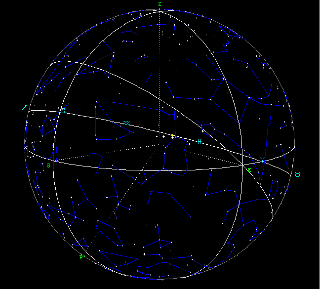

## Research Interests

{:.right}

- Hardware-software intersectionality
- [Cybernetics](https://web.mit.edu/esd.83/www/notebook/Cybernetics.PDF) and Digital Ethnography
- [Free Open-Source Software [FOSS]](https://opensource.org/osd)
- Cognitive Linguistics and Memetics
<!-- - Heterodox Archaeology and Mythopoeic Thought -->
- Machine Learning and Cryptography
- Literature and Poetry
- [Nuclear Energy](library/Nuclear%20Energy%20Basic%20Principles.pdf)

Most of my spare time is currently dedicated to the optimization of my [[Underpinnings of the Library|personal information system]] and the study of classical literature and embedded systems.

## Professional Achievements and Skills

### Multiple Language Proficiency
  - Human
    - English
    - French
    - Persian
    - Arabic
  - Computer
    - HTML, CSS, JS, Liquid
    - Java
    - C, C++
    - Ruby
    - Python
    - Bash, PowerShell

### Development and Maintenance of Personal Information System [Zettelkasten]

This project is, thus far, the culmination of my learning in Web Development and User Experience, drawing on my knowledge of interface design and full-stack development.

Along the way, I cleared all manner of obstacles: library incompatibility, edge-case bugs, and a limited knowledge of Ruby and Liquid. Countless hours were spent browsing the depths of niche tech forums, developer documentation and [man pages](https://en.wikipedia.org/wiki/Man_page), and several times I was forced to deviate heavily from my typical approach in order to solve a particularly difficult problem.

In the end, I am left with a powerful tool that has served me immensely in my personal and academic life, and will likely be a lifelong companion -- its effectiveness and features growing continuously alongside my own programming skills.

### Key Features:
- Static site generator written in Ruby with integration of Liquid and SCSS, parsing easily legible plain-text Markdown and injecting contents into standard-compliant HTML pages
- Git integration for automatic deploying of notes to website upon changes to files
- Editor agnostic: files may be edited with any software and deployed all the same, with a simple Git push
- Online component acting as a website, fully-functional offline component is a filing system for any notes/written output
- Fully modular independent feature library
  - Image gallery, document viewer, graph visualization, tiling windows, aliasing syntax, daily note generation
-  Fully functional out of the box, no technical knowledge required:
   - Can be customized without any technical knowledge, and with even a touch thereof it can be made into anything at all

## Objective

{:.right-aside}
"All that we shall do or say will amount to giving those who come afterwards facilities which we ourselves were not given. Here as everywhere else it is the beginning of the work that is hardest."\\
\- René Guénon

Production of neurotransmitter dopamine is stimulated by novelty, and it facilitates learning, information storage and pattern-recognition, as well as regulating emotion. Pattern-detection is important to learning, because the brain is able to compress complex raw data by identifying repetitious elements and storing information in association with the pattern, rather than making space for each node of information to be stored separately[^1]. For example, there is no need to memorize 1000 patterns of digits in order to count from 1 to 1000; the pattern is regular enough that the brain can derive each integer from a pattern it has stored, without storing each data point that the pattern produces.

<!--
I envision a world where the individual's agency is unrestricted and the flow of information is unimpeded by formality and greed -- a return to the paradigm of the Old Internet, born from the dialectic infinities of silicon and soul. Do not let my mention of technology deceive you -- what I seek is not innovation. I am indifferent to the progression or even erasure of the Internet. Rather, I seek to realize the highest purpose of all reason and intellect: the perception of the **Unadulterated Truth**. My pursuit is driven by a desire to resurrect the civilized anarchy of the Old World in order to foster a culture conducive to Truth-seeking, whether by scientific, religious, or philosophical means. The Internet is simply the greatest tool at my disposal. It is the agora of our age, a space where ideas converge and diverge; the collective consciousness made manifest. -->

TBC.

<!-- The Internet and our material lives are reflections of one another: a change in one is a change in the other. I envision a kind of cultural, and by extension, digital [palingenisis](https://en.wiktionary.org/wiki/palingenesis) -- a New Internet paradigm, born of the dialectic infinities of unrelenting self-interest and unsparing benevolence.  The key to achieving this, I believe, is to revive the principles of the Old Internet: unrestricted user agency, free information, anonymity, and UNIX philosophy.

What I seek through my work is not technical innovation; I am indifferent to the progression or even total annihilation of technology. Rather, I seek the end goal of all reason and intellect, the highest purpose of the human Soul: the perception of Truth. In order to realize this, however, I believe that the Internet is the greatest tool at my disposal. It is the agora of our age, a space where ideas converge and diverge, shaping contours of our shared consciousness. The ideals of the Old Internet -- my pursuit is driven by a vision to resurrect these ideals in our contemporary cultural landscape and reclaim the Internet as a domain of potential and creativity.

  -->

## Reading List
- Friedrich Nietzche - The Birth of Tragedy (1872)
- Albert Camus - The Myth of Sisyphus (1942)
- Albert Camus - The Stranger (1942)
- Antoine de Saint-Exupéry - The Little Prince (1943)
- Julius Evola – Ride the Tiger (1962)
- Yukio Mishima - Sun and Steel (1968)
- William Gibson – Neuromancer (1986)
- Yuk Hui – Cybernetics for the 21st century vol. 1 (2023)
- Yuk Hui – Post Europe (2024)

[//begin]: # "Autogenerated link references for markdown compatibility"
[Underpinnings of the Library|personal information system]: <_articles/Underpinnings of the Library> "Underpinnings of the Library"
[//end]: # "Autogenerated link references"